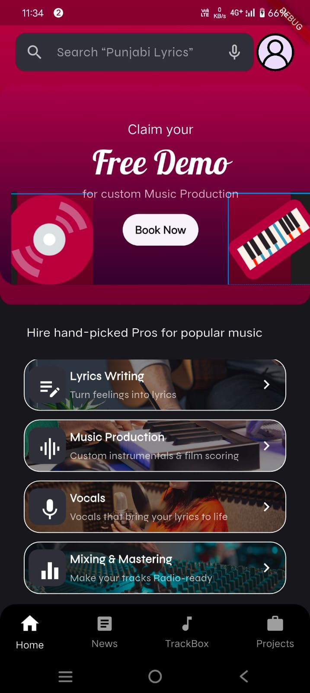

# s_rocks_music

Home Page for Music app
## Getting Started

This project is a starting point for a Flutter application.
A few resources to get you started if this is your first Flutter project:
A responsive UI

## How to install this
* clone the project first
* cd s_s_rocks_music
* flutter pub get
* flutter pub run

# structure
lib/
│
├── api/                   # API service classes or network logic
│   └── api_service.dart
│
├── models/                # Model/data classes
│   └── item_model.dart
│
├── screens/               # All screen-level widgets/pages
│   ├── custom_nav/        # e.g. Custom navigation bar or layout
│   │   └── custom_nav_screen.dart
│   │
│   ├── music_service/     # Related to music or media
│   │   └── music_service_screen.dart
│   │
│   └── item_description/  # Describes a product/item
│       └── item_description_screen.dart
│
├── widgets/               # Reusable widgets
│   ├── custom_button.dart
│   └── item_card.dart
│
├── routes/                # (Optional) Route management
│   └── app_routes.dart
│
├── constants/             # (Optional) App constants like colors, strings
│   ├── colors.dart
│   └── styles.dart
│
└── main.dart              # App entry point

assets/
├── images/                # App images
│   └── logo.png
│
└── fonts/                 # Custom fonts
├── syne/
│   └── Syne-Regular.ttf
└── lobstar/
└── Lobstar-Regular.ttf

# dependencies need install
    --firestore
    --firecore
    --
## final image
